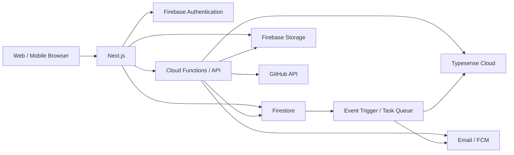

# Architecture

> Source: [opus4.6.md](../docs/srs/opus4.6.md) — Sections 3, 23, 24

## Technology Stack

| Layer | Technology | Purpose |
|---|---|---|
| Frontend | Next.js + TypeScript | SSR/SSG/ISR, App Router |
| Styling | Tailwind CSS | Utility-first CSS framework |
| Auth | Firebase Authentication | Email, Google, GitHub, Facebook OAuth |
| Database | Cloud Firestore | Document-based NoSQL |
| Storage | Firebase Storage | User uploads (images, PDFs) |
| Backend | Cloud Functions / Cloud Run | APIs, background jobs, webhooks |
| Search | Typesense Cloud | Full-text search (Thai + English) |
| Email | Transactional email (TBD) | Templates + webhooks |
| Push | Firebase Cloud Messaging | Push notifications |
| Analytics | Google Analytics + BigQuery | User analytics, event tracking |
| Hosting | Firebase Hosting / Vercel | Static + SSR hosting with CDN |
| Source Integration | GitHub API | Repository, releases, OAuth |

## Component Flow



## Environments

แยก Firebase project และ search cluster สำหรับ `development`, `staging`, `production` โดยไม่ใช้ข้อมูลหรือ secret ร่วมกัน

| Environment | Firebase Project | Typesense | Hosting |
|---|---|---|---|
| Development | `jariyah-dev` | Local/Dev cluster | localhost:3000 |
| Staging | `jariyah-staging` | Staging cluster | staging.jariyah.dev |
| Production | `jariyah-prod` | Production cluster | jariyah.dev |

## Caching & CDN Strategy

### Next.js Rendering Strategy

| หน้า | วิธี Render | Revalidation |
|---|---|---|
| Landing Page | ISR | revalidate ทุก 60 วินาที |
| Software List | ISR | revalidate ทุก 60 วินาที |
| Software Detail | ISR | revalidate ทุก 300 วินาที หรือ on-demand เมื่อ status เปลี่ยน |
| Article Detail | ISR | revalidate ทุก 300 วินาที |
| Developer Profile | ISR | revalidate ทุก 600 วินาที |
| Search Results | SSR | no cache (dynamic query) |
| Dashboard (Member/Admin) | CSR | no cache (authenticated) |
| Learning Path / Quiz | CSR | no cache (authenticated + progress) |

### API Response Caching

* Public GET endpoints: `Cache-Control: public, max-age=60, s-maxage=300, stale-while-revalidate=600`
* Authenticated endpoints: `Cache-Control: private, no-store`
* Mutation responses: `Cache-Control: no-store`
* ใช้ `ETag` สำหรับ conditional GET เพื่อลด bandwidth

### Client-Side Caching

* Firestore SDK persistence เปิดใช้สำหรับ offline support
* ใช้ SWR/React Query สำหรับ client-side data fetching พร้อม stale-while-revalidate
* Static assets: immutable hash filename + `Cache-Control: public, max-age=31536000, immutable`

## Monitoring & Observability

### Structured Logging

* ทุก Cloud Function และ API endpoint log เป็น JSON format ผ่าน Cloud Logging
* Log fields บังคับ: `severity`, `requestId`, `userId` (hashed), `action`, `duration_ms`, `status_code`
* **ห้าม log**: plaintext token, email, IP address, file content, API key secret
* Log retention: 30 วันใน Cloud Logging, export ไป BigQuery สำหรับ long-term analysis

### Key Metrics

| Metric | Source |
|---|---|
| API request rate / latency / error rate | Cloud Functions metrics |
| Firestore read/write/delete operations | Firebase Console |
| Storage upload size / count | Firebase Storage metrics |
| Search query latency / zero-result rate | Typesense Cloud + custom log |
| Active users (DAU/MAU) | Google Analytics |
| Moderation queue backlog | Firestore aggregate query |
| Notification delivery success/failure | Custom notifications aggregation |

### Alerting Rules

| Condition | Severity | Action |
|---|---|---|
| API error rate > 2% ใน 5 นาที | Critical | On-call investigate |
| API p95 latency > 1,000 ms ใน 10 นาที | Warning | Investigate |
| Firestore daily read > 80% of budget | Warning | Review query patterns |
| Search sync queue lag > 5 นาที | Warning | Check Cloud Functions |
| Search sync dead-letter > 0 | Critical | Manual reconciliation |
| Notification failure rate > 5% | Warning | Check email provider |

### Health Checks

* `/api/health` endpoint (public, no auth): ตรวจ Firestore + Typesense connectivity
* Scheduled function ทุก 5 นาที: ตรวจ external dependencies (GitHub API, email provider)
* Uptime check จาก Cloud Monitoring ที่ `/api/health` ทุก 1 นาที

## Search Architecture

* **Engine**: Typesense Cloud (ไม่ใช้ Firestore สำหรับ full-text search)
* **Source of truth**: Firestore; Typesense เป็น read model ที่สร้างใหม่ได้
* **Sync**: Firestore trigger → Cloud Functions → Typesense upsert/remove
* **Thai support**: Thai tokenizer + synonyms (`เอไอ <-> AI`)
* **SLO**: p95 ไม่เกิน 500 ms, index freshness ไม่เกิน 60 วินาที

### Ranking Formula

```
finalScore =
  textRelevance * 0.55 +
  normalizedPopularity * 0.20 +
  freshness * 0.15 +
  qualityScore * 0.10
```
