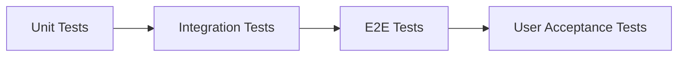

# Testing Guide

> Source: [opus4.6.md](../docs/srs/opus4.6.md) — Sections 17, 9, 16

## Testing Strategy



## Frameworks & Tools

| Layer | Tool | Purpose |
|---|---|---|
| Unit Test | Jest / Vitest | Functions, utilities, validators |
| Component Test | React Testing Library | UI component behavior |
| Integration Test | Firestore Emulator + Jest | API + database interaction |
| E2E Test | Playwright | Full user flows in browser |
| Security Rules Test | `@firebase/rules-unit-testing` | Firestore + Storage rules |
| API Contract Test | OpenAPI validator | API response validation |
| Performance | Lighthouse CI | Core Web Vitals monitoring |
| Static Analysis | ESLint + TypeScript strict | Code quality enforcement |

## Coverage Targets

| Layer | Target | Scope |
|---|---|---|
| Unit Tests | ≥ 70% | Shared validators, utils, hooks |
| Integration Tests | ≥ 60% | API endpoints, Firestore operations |
| Security Rules | 100% | Every allow/deny path for every role |
| E2E | Critical paths | Auth, software CRUD, moderation workflow |

---

## Test Patterns

### Unit Test (Zod Validators)

```typescript
// __tests__/validators/software.test.ts
import { softwareSchema } from '@/lib/validators/software';

describe('softwareSchema', () => {
  it('rejects empty name', () => {
    const result = softwareSchema.safeParse({ name: '' });
    expect(result.success).toBe(false);
  });

  it('accepts valid software', () => {
    const result = softwareSchema.safeParse({
      name: 'Thai Utility',
      shortDescription: 'เครื่องมือจัดการไฟล์',
      categoryId: 'productivity',
      platforms: ['windows'],
      licenseId: 'MIT',
    });
    expect(result.success).toBe(true);
  });
});
```

### Security Rules Test

```typescript
// __tests__/rules/software.test.ts
import { assertSucceeds, assertFails } from '@firebase/rules-unit-testing';

describe('software rules', () => {
  it('guest can read published software', async () => {
    const db = getGuestFirestore();
    await assertSucceeds(db.doc('software/pub1').get());
  });

  it('guest cannot read draft software', async () => {
    const db = getGuestFirestore();
    await assertFails(db.doc('software/draft1').get());
  });

  it('developer can create draft', async () => {
    const db = getDeveloperFirestore('dev1');
    await assertSucceeds(db.collection('software').add({
      ownerId: 'dev1', status: 'draft', name: 'Test', /* ... */
    }));
  });

  it('developer cannot approve own software', async () => {
    const db = getDeveloperFirestore('dev1');
    await assertFails(db.doc('software/sw1').update({ status: 'approved' }));
  });

  it('moderator can read all software', async () => {
    const db = getModeratorFirestore('mod1');
    await assertSucceeds(db.doc('software/draft1').get());
  });
});
```

### Integration Test (API)

```typescript
// __tests__/api/software.test.ts
describe('POST /api/v1/software', () => {
  it('requires authentication', async () => {
    const res = await request(app).post('/api/v1/software').send({});
    expect(res.status).toBe(401);
  });

  it('creates draft for developer', async () => {
    const res = await request(app)
      .post('/api/v1/software')
      .set('Authorization', `Bearer ${devToken}`)
      .set('Idempotency-Key', 'idem-001')
      .send(validSoftware);
    expect(res.status).toBe(201);
    expect(res.body.data.status).toBe('draft');
  });

  it('idempotent on duplicate key', async () => {
    const res = await request(app)
      .post('/api/v1/software')
      .set('Authorization', `Bearer ${devToken}`)
      .set('Idempotency-Key', 'idem-001')
      .send(validSoftware);
    expect(res.status).toBe(200); // same resource, no duplicate
  });
});
```

### E2E Test (Playwright)

```typescript
// e2e/software-submission.spec.ts
test('developer submits software successfully', async ({ page }) => {
  await page.goto('/th/dashboard');
  await page.click('[data-testid="add-software"]');
  await page.fill('[data-testid="name-input"]', 'Test Software');
  await page.fill('[data-testid="description-input"]', 'Description...');
  await page.selectOption('[data-testid="category-select"]', 'productivity');
  await page.click('[data-testid="submit-button"]');
  await expect(page.locator('[data-testid="status-badge"]')).toHaveText('submitted');
});
```

---

## Test Environments

| Environment | Database | Auth | Search |
|---|---|---|---|
| Unit | Mock | Mock | Mock |
| Integration | Firestore Emulator | Auth Emulator | Mock Typesense |
| E2E | Firestore Emulator | Auth Emulator | Typesense local |
| Staging | Staging Firestore | Firebase Auth | Typesense Staging |

## CI/CD Integration

```yaml
# GitHub Actions workflow
- name: Lint & Type Check
  run: npm run lint && npm run type-check

- name: Unit & Integration Tests
  run: npm run test -- --coverage

- name: Security Rules Test
  run: npm run test:rules

- name: E2E Tests
  run: npx playwright test

- name: Lighthouse CI
  run: npx lhci autorun
```

## Definition of Done

- [ ] Code compiles without TypeScript errors
- [ ] Unit tests written and passing
- [ ] Security rules tested (allow + deny paths)
- [ ] API contract matches OpenAPI spec
- [ ] UI states handled: loading, empty, error, success
- [ ] i18n keys used (no hardcoded text)
- [ ] Responsive on mobile, tablet, desktop
- [ ] Accessibility checklist passed
- [ ] No `console.log` in production code
- [ ] PR reviewed and approved
