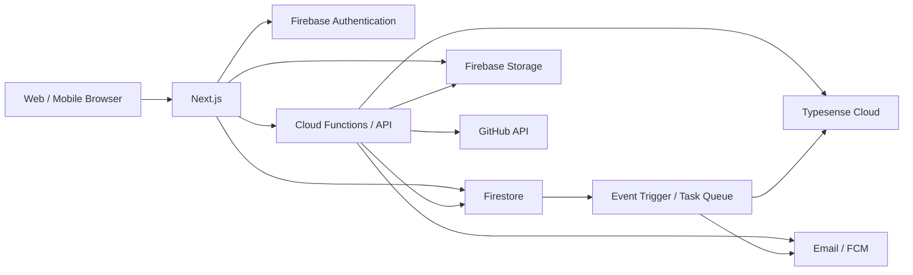
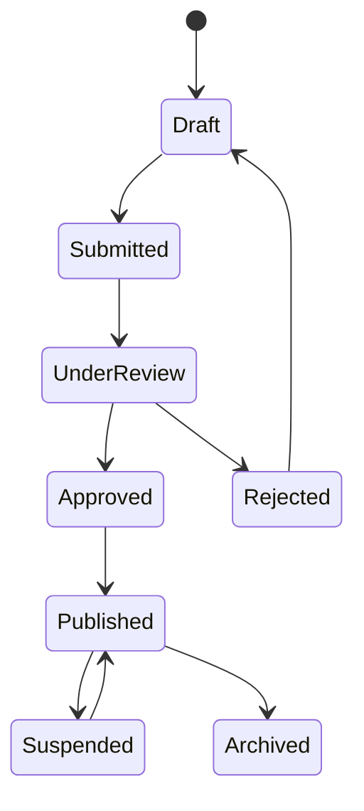
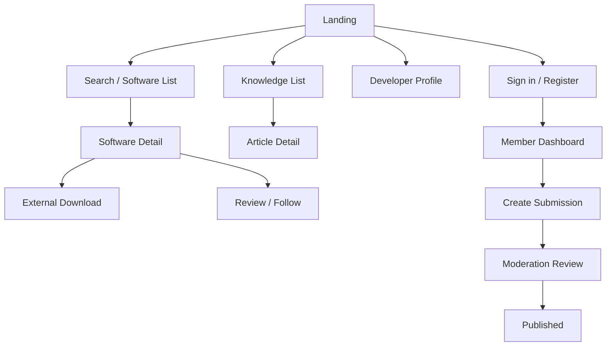

# TOR / Software Requirement Specification (SRS)

## Digital Software & Knowledge Platform

แพลตฟอร์มศูนย์กลางซอฟต์แวร์ องค์ความรู้ดิจิทัล การเรียนรู้ กิจกรรม งาน และชุมชนนักพัฒนาซอฟต์แวร์สำหรับประชาชน

**Document version:** 3.5-Flash (Consolidated)  
**Status:** Development-ready specification  
**Primary stack:** Next.js, TypeScript, Firebase Authentication, Firestore, Firebase Storage, Cloud Functions, Typesense Cloud

---

# 1. วัตถุประสงค์และขอบเขต

1. เผยแพร่ซอฟต์แวร์ที่พัฒนาโดยคนไทยให้ประชาชนเข้าถึงได้
2. ส่งเสริมการใช้เทคโนโลยีดิจิทัลอย่างถูกต้องและปลอดภัย
3. เผยแพร่ความรู้ด้าน AI เทคโนโลยีสารสนเทศ และ Open Source
4. สร้างพื้นที่ให้นักพัฒนาเผยแพร่ผลงานและสร้างชุมชน
5. สนับสนุนโครงการ Open Source การเรียนรู้ กิจกรรม และการจับคู่งาน
6. มีระบบกำกับดูแลเนื้อหา ความปลอดภัย PDPA และ Audit Trail

## 1.1 โมดูลในขอบเขต

* Software Hub
* Knowledge Hub
* Developer Portal
* Learning System
* Event Management
* Open Source Incubator
* Job & Collaboration Board
* Notification Center
* Search
* Analytics Dashboard
* Public API
* Administration and Moderation

## 1.2 นอกขอบเขต MVP

* การรับชำระเงินเต็มรูปแบบ
* Mobile application แบบ native
* AI recommendation แบบ personalization
* Government Single Sign-On

---

# 2. กลุ่มผู้ใช้งานและสิทธิ์

| Role | สิทธิ์หลัก |
|---|---|
| Guest | ดูและค้นหาเนื้อหาที่เผยแพร่ ดาวน์โหลดซอฟต์แวร์ สมัครสมาชิก |
| Member | สิทธิ์ Guest รวมถึงรีวิว ให้คะแนน แสดงความคิดเห็น ติดตาม สมัครกิจกรรมและหลักสูตร |
| Developer | สิทธิ์ Member รวมถึงสร้างโปรไฟล์ ส่งซอฟต์แวร์ บทความ โครงการ และประกาศงาน |
| Moderator | ตรวจสอบ อนุมัติ ปฏิเสธ ซ่อนเนื้อหา และจัดการรายงานตามขอบเขตที่ได้รับ |
| Administrator | จัดการผู้ใช้ Role สิทธิ์ หมวดหมู่ Badge การตั้งค่าระบบ และ Audit Log |

หลัก Least Privilege:

* Role ถูกเก็บใน Firebase Auth custom claims และสำเนาใน `users.role`
* Security Rules ใช้ custom claims เป็นแหล่งตัดสินสิทธิ์
* Client ห้ามแก้ `role`, `status`, `reputationScore` และข้อมูลอนุมัติโดยตรง
* การเปลี่ยน Role ต้องทำผ่าน Admin API และบันทึก Audit Log

---

# 3. สถาปัตยกรรมระบบ

## 3.1 Technology Stack

* Frontend: Next.js, TypeScript, Tailwind CSS
* Authentication: Firebase Authentication รองรับ Email, Google, GitHub และ Facebook
* Database: Cloud Firestore
* File storage: Firebase Storage
* Backend: Firebase Cloud Functions หรือ Cloud Run สำหรับ Public API และงาน background
* Source repository integration: GitHub API และ GitHub Releases
* Search: Typesense Cloud
* Email: ผู้ให้บริการ transactional email ที่รองรับ template และ webhook
* Push: Firebase Cloud Messaging
* Analytics: Google Analytics และ event aggregation ใน Firestore/BigQuery
* Hosting: Firebase Hosting หรือ Vercel

## 3.2 Component Flow



## 3.3 Environment

แยก Firebase project และ search cluster สำหรับ `development`, `staging`, `production` โดยไม่ใช้ข้อมูลหรือ secret ร่วมกัน

---

# 4. Functional Requirements

## 4.1 Software Hub

* แสดงรายการ ชื่อ โลโก้ คำอธิบาย หมวดหมู่ Tag ผู้พัฒนา เวอร์ชัน วันที่อัปเดต License และ platform
* หน้ารายละเอียดมี screenshot, feature, changelog, documentation, FAQ, checksum และช่องทางดาวน์โหลด
* ดาวน์โหลดจาก GitHub Release, Google Play, App Store หรือเว็บไซต์ที่ผ่านการตรวจสอบ
* สมาชิกให้คะแนน 1-5 ดาวและรีวิวได้หนึ่งรายการต่อซอฟต์แวร์
* Developer สร้าง draft ส่งตรวจ แก้ไข และออกเวอร์ชันใหม่ได้
* สถานะ: `draft`, `submitted`, `under_review`, `approved`, `published`, `rejected`, `suspended`, `archived`

## 4.2 Knowledge Hub

* รองรับ Article, Video, PDF, Infographic และ Tutorial
* หมวดเริ่มต้น: AI, Windows, Linux, Android, iOS, Programming, IoT, Cybersecurity, Open Source และ Productivity
* รองรับเนื้อหาภาษาไทยและอังกฤษ, slug, SEO metadata, Tag และผู้เขียน
* สถานะ: `draft`, `submitted`, `review`, `approved`, `published`, `rejected`, `archived`
* ฝังลิงก์ YouTube, TikTok, Facebook และ GitHub โดย validate domain

## 4.3 Developer Portal

* โปรไฟล์ประกอบด้วยรูป ประวัติ ทักษะ GitHub เว็บไซต์ Social link Badge และผลงาน
* แสดงสถิติ Downloads, Views, Followers, Reputation และ Ranking
* เชื่อม GitHub ด้วย OAuth โดยขอ scope เท่าที่จำเป็น

## 4.4 Learning System

* Learning Path ประกอบด้วยบทเรียนเรียงลำดับ prerequisite และแบบทดสอบ
* รองรับ Multiple Choice และ Practical Exercise
* บันทึก progress ต่อสมาชิก
* ออก Certificate เมื่อเรียนครบและผ่านคะแนนขั้นต่ำ

## 4.5 Event Management

* รองรับ Webinar, Workshop, Meetup, Hackathon และ Competition
* สมาชิกสมัคร ยกเลิก เข้าร่วม waitlist และดาวน์โหลด Certificate ได้
* ป้องกันการสมัครเกิน capacity ด้วย transaction

## 4.6 Open Source Incubator

* ระยะโครงการ: `idea`, `prototype`, `beta`, `stable`, `mature`
* Role ในโครงการ: Project Owner, Mentor และ Contributor
* รองรับประกาศงานย่อย ทักษะที่ต้องการ และการสมัครเข้าร่วม

## 4.7 Job & Collaboration Board

* งาน: Full Time, Part Time, Freelance และ Internship
* Contributor: Frontend, Backend, Mobile, Designer, Tester และ Documentation
* ประกาศมีวันหมดอายุ สถานะ และช่องทางสมัคร
* Moderator ซ่อนประกาศหลอกลวง ผิดกฎหมาย หรือหมดอายุได้

## 4.8 Badge, Reputation และ Ranking

* ระดับสมาชิก: Bronze, Silver, Gold, Platinum และ Elite
* Badge เริ่มต้น: First Software, Open Source Contributor, Top Author, Top Developer, Community Helper และ Verified Developer
* Reputation เปลี่ยนผ่าน server-side transaction และมี `reputation_logs` ทุกครั้ง
* Ranking software: Downloads 40%, Ratings 25%, Maintenance 15%, Active Users 10%, Documentation 10%
* ระบบต้องเก็บ component score เพื่ออธิบายผลการจัดอันดับได้

## 4.9 Certification

ระดับ: Verified Software, Security Checked, Open Source Verified, Community Recommended และ Editor Choice

แต่ละรายการต้องมีผู้ตรวจสอบ วันที่ออก วันหมดอายุ เกณฑ์ รายงาน และสถานะเพิกถอน

## 4.10 Analytics Dashboard

Administrator เห็น:

* สมาชิกใหม่และ active users แยกตามช่วงเวลา
* จำนวนซอฟต์แวร์ บทความ ดาวน์โหลด รีวิว และ submission backlog
* Review SLA, rejection reason, report volume และ notification failure
* Search query แบบ aggregate, zero-result query และ click-through rate

Developer เห็นเฉพาะข้อมูลผลงานของตน:

* Views, Downloads, Followers, Ratings และ Ranking
* แนวโน้มรายวัน/รายเดือน โดยไม่เปิดเผยตัวตนผู้เข้าชม
* Export CSV ตามช่วงเวลา

Metric ต้องระบุ timezone, aggregation window และ freshness ข้อมูล ห้าม query raw event ปริมาณสูงจาก client โดยตรง

## 4.11 Community และ External Content

* แสดงลิงก์ Facebook Group และ Discord Server ที่ผ่านการตั้งค่าจาก Admin
* รองรับ embedded content จาก YouTube, TikTok, Facebook และ GitHub ผ่าน provider allowlist
* External link ใช้ `rel="noopener noreferrer"` และแสดงชื่อ provider
* ระบบต้องไม่ส่งข้อมูลผู้ใช้ไป third party ก่อน consent ที่เกี่ยวข้อง
* Broken or unsafe external link สามารถปิดจาก Admin ได้โดยไม่ deploy ใหม่

---

# 5. Workflow และ State Transition



ข้อกำหนด:

* เจ้าของแก้ไขได้เฉพาะ `draft` และ `rejected`
* การแก้เนื้อหาที่ `published` สร้าง revision ใหม่ โดยฉบับเดิมยังเผยแพร่จน revision ผ่าน
* Moderator ห้ามอนุมัติผลงานของตนเอง
* Reject ต้องระบุ reason code และข้อความ
* ทุก transition ต้องบันทึก actor, เวลา, before/after, reason และ request ID ใน `audit_logs`

---

# 6. Wireframe และ UI Flow

## 6.1 Landing Page

```text
+------------------------------------------------------------------+
| Logo | Software | Knowledge | Learn | Events | Jobs | Search | Me |
+------------------------------------------------------------------+
| Hero: ค้นหาซอฟต์แวร์และความรู้ดิจิทัล [ Search................ ] |
| [Browse Software] [Explore Knowledge]                             |
+------------------------------------------------------------------+
| Featured Software: [Card] [Card] [Card] [Card]                    |
| Latest Knowledge:  [Article] [Article] [Video]                     |
| Upcoming Events:   [Event] [Event]                                 |
| Top Developers:    [Profile] [Profile] [Profile]                   |
+------------------------------------------------------------------+
| Footer: About | Terms | Privacy | Contact | Language               |
+------------------------------------------------------------------+
```

## 6.2 Software List

```text
+------------------------------------------------------------------+
| Search [........................] Sort [Relevance v]                |
+-------------------+----------------------------------------------+
| Filters           | Result count / active filter chips           |
| Category          | [Software Card] [Software Card]               |
| Platform          | [Software Card] [Software Card]               |
| License           | [Software Card] [Software Card]               |
| Rating            | Pagination / Load more                        |
+-------------------+----------------------------------------------+
```

## 6.3 Software Detail

```text
+------------------------------------------------------------------+
| Logo | Name | Verified | Rating | Follow | Download                |
| Developer | Version | Updated | Platforms | License                |
+------------------------------------------------------------------+
| Overview | Screenshots | Changelog | Reviews | Documentation       |
| Main content                                      | Related items  |
+------------------------------------------------------------------+
```

## 6.4 Developer Profile

```text
+------------------------------------------------------------------+
| Avatar | Display name | Verified | Follow                          |
| Bio | Skills | GitHub | Website | Reputation | Badges              |
+------------------------------------------------------------------+
| Portfolio | Software | Articles | Projects | Activity              |
+------------------------------------------------------------------+
```

## 6.5 Primary UI Flow



Responsive requirements:

* Mobile ใช้ bottom sheet สำหรับ filter และ sticky primary action
* Keyboard navigation ครบทุก interactive element
* Color contrast และ focus state ผ่าน WCAG 2.1 AA
* Loading, empty, error และ permission-denied state ต้องมีในทุกหน้ารายการ

---

# 7. Firestore Data Model

## 7.1 Conventions

* Document ID ใช้ Firestore auto ID ยกเว้น singleton และ deterministic relation
* เวลาใช้ Firestore `Timestamp` และชื่อ `createdAt`, `updatedAt`
* ผู้สร้าง/ผู้แก้ใช้ Firebase UID ใน `createdBy`, `updatedBy`
* Field ที่ลงท้าย `Id` เป็น document ID, ไม่เก็บ `DocumentReference` เพื่อให้ง่ายต่อ API/search
* Public document ต้องมี `status` และ `publishedAt`
* Soft delete ใช้ `deletedAt`; ห้ามลบทันทีเว้นแต่หมด retention period
* ค่าเงินใช้ integer หน่วยย่อยสุด ห้ามใช้ floating point
* Counter ที่มี traffic สูงใช้ distributed counter หรือ event aggregation
* Schema validation ทำซ้ำทั้ง API, Cloud Functions และ Security Rules

Notation: `!` = required, `?` = optional, `[]` = array

## 7.2 Core Collections

### `users/{uid}`

| Field | Type | Req. | รายละเอียด |
|---|---|---:|---|
| email | string | yes | normalized email; อ่านได้เฉพาะเจ้าของ/Admin |
| displayName | string | yes | 2-80 ตัวอักษร |
| photoURL | string | no | HTTPS URL |
| role | enum | yes | `member`, `developer`, `moderator`, `admin` |
| status | enum | yes | `active`, `suspended`, `deleted` |
| locale | enum | yes | `th`, `en` |
| notificationPreferences | map | yes | email/push/inApp แยกตาม event |
| termsAcceptedAt | timestamp | yes | เวอร์ชันล่าสุดที่ยอมรับ |
| lastLoginAt | timestamp | no | server only |
| createdAt, updatedAt | timestamp | yes | server timestamp |

Indexes: `(role, status, createdAt desc)`, `(status, createdAt desc)`

### `developers/{uid}`

| Field | Type | Req. | รายละเอียด |
|---|---|---:|---|
| displayName, slug | string | yes | slug unique ผ่าน reservation transaction |
| bio | string | no | สูงสุด 2,000 ตัวอักษร |
| skills | string[] | no | สูงสุด 30 ค่า |
| githubUsername, websiteURL | string | no | validate URL/username |
| socialLinks | map | no | allowlist provider |
| verificationStatus | enum | yes | `unverified`, `pending`, `verified`, `rejected` |
| reputationScore, followerCount | number | yes | server only |
| createdAt, updatedAt | timestamp | yes | server timestamp |

Indexes: `(verificationStatus, reputationScore desc)`, `(skills array-contains, reputationScore desc)`

### `software/{softwareId}`

| Field | Type | Req. | รายละเอียด |
|---|---|---:|---|
| ownerId, name, slug | string | yes | owner UID และ public slug |
| shortDescription | string | yes | สูงสุด 240 ตัวอักษร |
| description | string | yes | sanitized Markdown |
| categoryId | string | yes | active category |
| tagIds, platforms | string[] | yes | arrays แบบจำกัดจำนวน |
| licenseId | string | yes | อ้างถึง `licenses` |
| logoPath, screenshotPaths | string/string[] | no | Storage path ไม่ใช่ arbitrary URL |
| repositoryURL, websiteURL | string | no | HTTPS allowlist |
| latestVersionId | string | no | server maintained |
| status | enum | yes | workflow state |
| ratingAverage, ratingCount, downloadCount | number | yes | server only |
| searchSyncStatus | enum | yes | `pending`, `synced`, `failed` |
| publishedAt, createdAt, updatedAt, deletedAt | timestamp | mixed | lifecycle |

Indexes: `(status, publishedAt desc)`, `(status, categoryId, publishedAt desc)`, `(status, ownerId, updatedAt desc)`, `(status, ratingAverage desc)`, `(tagIds array-contains, status, publishedAt desc)`

### `software_versions/{versionId}`

Fields: `softwareId! string`, `version! string`, `releaseNotes! string`, `downloadLinks! map[]`, `checksum? string`, `fileSize? number`, `minimumRequirements? map`, `releaseDate! timestamp`, `status! enum`, `createdBy! string`, `createdAt! timestamp`

Indexes: `(softwareId, status, releaseDate desc)`, `(status, releaseDate desc)`

### `software_categories/{categoryId}`

Fields: `name! localizedMap`, `slug! string`, `description? localizedMap`, `icon? string`, `sortOrder! number`, `isActive! boolean`, `createdAt! timestamp`, `updatedAt! timestamp`

Indexes: `(isActive, sortOrder)`

### `software_certifications/{certificationId}`

Fields: `softwareId! string`, `type! enum`, `status! enum`, `reviewerId! string`, `criteriaResults! map`, `reportPath? string`, `issuedAt! timestamp`, `expiresAt? timestamp`, `revokedAt? timestamp`, `notes? string`

Indexes: `(softwareId, status, issuedAt desc)`, `(status, expiresAt)`

### `articles/{articleId}`

Fields: `authorId! string`, `title! string`, `slug! string`, `excerpt! string`, `body! string`, `contentType! enum`, `categoryId! string`, `tagIds! string[]`, `language! enum`, `coverPath? string`, `externalURL? string`, `status! enum`, `viewCount! number`, `publishedAt? timestamp`, `createdAt! timestamp`, `updatedAt! timestamp`

Indexes: `(status, publishedAt desc)`, `(status, categoryId, publishedAt desc)`, `(authorId, status, updatedAt desc)`, `(tagIds array-contains, status, publishedAt desc)`

### `article_categories/{categoryId}`

ใช้ schema เดียวกับ `software_categories`

### `videos/{videoId}`

Fields: `authorId! string`, `title! string`, `description! string`, `provider! enum`, `externalURL! string`, `thumbnailURL? string`, `categoryId! string`, `tagIds! string[]`, `durationSeconds? number`, `language! enum`, `status! enum`, `publishedAt? timestamp`, `createdAt! timestamp`, `updatedAt! timestamp`

Indexes: `(status, publishedAt desc)`, `(status, categoryId, publishedAt desc)`

## 7.3 Community Collections

### `reviews/{reviewId}`

Fields: `softwareId! string`, `userId! string`, `rating! number(1..5)`, `title? string`, `body! string`, `status! enum`, `moderationReason? string`, `createdAt! timestamp`, `updatedAt! timestamp`

Document ID ต้องเป็น hash/deterministic key ของ `softwareId_userId` เพื่อบังคับหนึ่งรีวิวต่อคน

Indexes: `(softwareId, status, createdAt desc)`, `(userId, createdAt desc)`, `(softwareId, status, rating)`

### `comments/{commentId}`

Fields: `targetType! enum`, `targetId! string`, `parentId? string`, `userId! string`, `body! string`, `status! enum`, `createdAt! timestamp`, `updatedAt! timestamp`

Indexes: `(targetType, targetId, status, createdAt)`, `(userId, createdAt desc)`

### `follows/{followId}`

Fields: `followerId! string`, `targetType! enum`, `targetId! string`, `createdAt! timestamp`

Document ID เป็น deterministic key; indexes: `(followerId, targetType, createdAt desc)`, `(targetType, targetId, createdAt desc)`

### `reports/{reportId}`

Fields: `reporterId! string`, `targetType! enum`, `targetId! string`, `reasonCode! enum`, `details? string`, `status! enum`, `assignedTo? string`, `createdAt! timestamp`, `updatedAt! timestamp`

Indexes: `(status, createdAt)`, `(assignedTo, status, createdAt)`, `(targetType, targetId, createdAt desc)`

### `report_actions/{actionId}`

Fields: `reportId! string`, `actorId! string`, `action! enum`, `note? string`, `createdAt! timestamp`

Index: `(reportId, createdAt)`

## 7.4 Learning, Event, Job และ Incubator

### `learning_paths/{pathId}`

Fields: `title! localizedMap`, `description! localizedMap`, `level! enum`, `lessonIds! string[]`, `prerequisitePathIds? string[]`, `estimatedMinutes! number`, `passingScore! number`, `status! enum`, `sortOrder! number`, `createdAt! timestamp`, `updatedAt! timestamp`

Indexes: `(status, level, sortOrder)`, `(status, updatedAt desc)`

### `quizzes/{quizId}`

Fields: `learningPathId! string`, `title! localizedMap`, `questions! map[]`, `passingScore! number`, `attemptLimit? number`, `status! enum`, `createdAt! timestamp`, `updatedAt! timestamp`

คำตอบที่ถูกต้องห้ามอ่านจาก client ก่อนส่งคำตอบ; production ควรแยก answer key ไป server-only collection

### `certificates/{certificateId}`

Fields: `userId! string`, `learningPathId? string`, `eventId? string`, `certificateNumber! string`, `verificationCode! string`, `issuedAt! timestamp`, `revokedAt? timestamp`, `filePath? string`

Indexes: `(userId, issuedAt desc)`, `(verificationCode)`

### `events/{eventId}`

Fields: `organizerId! string`, `title! string`, `description! string`, `type! enum`, `venueType! enum`, `venue? map`, `startAt! timestamp`, `endAt! timestamp`, `capacity? number`, `registrationCount! number`, `registrationDeadline! timestamp`, `status! enum`, `createdAt! timestamp`, `updatedAt! timestamp`

Indexes: `(status, startAt)`, `(organizerId, status, startAt desc)`, `(type, status, startAt)`

การสมัครเก็บใน `events/{eventId}/registrations/{uid}`: `userId!`, `status! enum`, `registeredAt!`, `attendedAt?`, `cancelledAt?`

### `jobs/{jobId}`

Fields: `ownerId! string`, `organization! string`, `title! string`, `description! string`, `jobType! enum`, `workMode! enum`, `location? string`, `skills! string[]`, `applicationURL! string`, `salaryRange? map`, `status! enum`, `expiresAt! timestamp`, `publishedAt? timestamp`, `createdAt! timestamp`, `updatedAt! timestamp`

Indexes: `(status, expiresAt, publishedAt desc)`, `(jobType, status, publishedAt desc)`, `(skills array-contains, status, publishedAt desc)`

### `incubator_projects/{projectId}`

Fields: `ownerId! string`, `name! string`, `description! string`, `stage! enum`, `repositoryURL? string`, `skillNeeds! string[]`, `mentorIds! string[]`, `contributorIds! string[]`, `status! enum`, `createdAt! timestamp`, `updatedAt! timestamp`

Indexes: `(status, stage, updatedAt desc)`, `(skillNeeds array-contains, status, updatedAt desc)`

### `mentor_profiles/{uid}`

Fields: `expertise! string[]`, `bio! string`, `availability! enum`, `maxProjects! number`, `activeProjectCount! number`, `status! enum`, `updatedAt! timestamp`

Indexes: `(status, availability)`, `(expertise array-contains, status)`

## 7.5 System Collections

### `badges/{badgeId}`

Fields: `code! string`, `name! localizedMap`, `description! localizedMap`, `iconPath! string`, `criteria! map`, `isActive! boolean`, `createdAt! timestamp`, `updatedAt! timestamp`

### `developer_badges/{awardId}`

Fields: `developerId! string`, `badgeId! string`, `awardedAt! timestamp`, `awardedBy! string`, `reason? string`, `revokedAt? timestamp`

Indexes: `(developerId, awardedAt desc)`, `(badgeId, awardedAt desc)`

### `reputation_logs/{logId}`

Fields: `userId! string`, `eventType! enum`, `points! number`, `sourceType! string`, `sourceId! string`, `balanceAfter! number`, `createdAt! timestamp`

Indexes: `(userId, createdAt desc)`, `(eventType, createdAt desc)`

### `downloads/{downloadId}`

Fields: `softwareId! string`, `versionId? string`, `userId? string`, `anonymousIdHash? string`, `source! enum`, `countryCode? string`, `createdAt! timestamp`

Indexes: `(softwareId, createdAt desc)`, `(createdAt desc)`; raw event retention 90 วันแล้ว aggregate

### `notifications/{notificationId}`

Fields: `userId! string`, `type! enum`, `channel! enum`, `templateId! string`, `data! map`, `status! enum`, `readAt? timestamp`, `sentAt? timestamp`, `errorCode? string`, `createdAt! timestamp`

Indexes: `(userId, status, createdAt desc)`, `(status, createdAt)`

### `api_keys/{keyId}`

Fields: `ownerId! string`, `name! string`, `keyPrefix! string`, `secretHash! string`, `scopes! string[]`, `status! enum`, `rateLimitTier! string`, `lastUsedAt? timestamp`, `expiresAt? timestamp`, `createdAt! timestamp`, `revokedAt? timestamp`

ห้ามเก็บ plaintext key; indexes: `(ownerId, status, createdAt desc)`, `(keyPrefix)`

### `audit_logs/{logId}`

Fields: `actorId? string`, `actorRole? string`, `action! string`, `resourceType! string`, `resourceId! string`, `before? map`, `after? map`, `reason? string`, `ipHash? string`, `requestId! string`, `createdAt! timestamp`

Indexes: `(resourceType, resourceId, createdAt desc)`, `(actorId, createdAt desc)`, `(action, createdAt desc)`

### `search_logs/{logId}`

Fields: `queryHash! string`, `normalizedQuery? string`, `filters? map`, `resultCount! number`, `clickedResultId? string`, `userId? string`, `createdAt! timestamp`

เก็บ query เต็มเฉพาะเมื่อผ่าน privacy review; retention 90 วัน

### `licenses/{licenseId}`

Fields: `spdxId! string`, `name! string`, `url! string`, `isOpenSource! boolean`, `isActive! boolean`, `sortOrder! number`

### `software_tags/{tagId}` และ `article_tags/{tagId}`

Fields: `name! localizedMap`, `slug! string`, `aliases! string[]`, `isActive! boolean`, `usageCount! number`, `createdAt! timestamp`, `updatedAt! timestamp`

### `system_settings/{settingId}`

Fields: `value! map`, `version! number`, `updatedBy! string`, `updatedAt! timestamp`

อ่าน/เขียนเฉพาะ Admin API; public settings ต้องเผยแพร่ผ่าน endpoint แบบ allowlist

### `system_metrics/{metricId}`

Fields: `metric! string`, `period! enum`, `periodStart! timestamp`, `dimensions! map`, `value! number`, `updatedAt! timestamp`

Indexes: `(metric, period, periodStart desc)`

> `audit_events` จากเอกสารเดิมถูกรวมเป็น `audit_logs` เพื่อไม่ให้มีข้อมูล audit ซ้ำสองแหล่ง

---

# 8. Public API Specification

## 8.1 General Contract

* Base URL: `/api/v1`
* Content type: `application/json; charset=utf-8`
* Public read endpoint ใช้ API key ผ่าน `X-API-Key`
* Member endpoint ใช้ Firebase ID token ผ่าน `Authorization: Bearer <token>`
* Admin/Moderator endpoint ต้องมี ID token, custom claim และ App Check สำหรับ first-party client
* Pagination ใช้ cursor: `?limit=20&cursor=<opaque>`; limit สูงสุด 100
* เวลาใช้ ISO 8601 UTC
* Mutation รองรับ `Idempotency-Key`
* Response ทุกครั้งมี `requestId`

Success:

```json
{
  "data": {},
  "meta": {
    "requestId": "req_01...",
    "nextCursor": null
  }
}
```

Error:

```json
{
  "error": {
    "code": "VALIDATION_ERROR",
    "message": "Request validation failed",
    "fields": [{"field": "name", "reason": "required"}],
    "requestId": "req_01..."
  }
}
```

## 8.2 Software API

| Method | Endpoint | Auth | รายละเอียด |
|---|---|---|---|
| GET | `/software` | API key | รายการ published; filter `q,category,tag,platform,sort` |
| GET | `/software/{idOrSlug}` | API key | รายละเอียดและ latest version |
| GET | `/software/{id}/versions` | API key | เวอร์ชันที่เผยแพร่ |
| POST | `/software` | Developer | สร้าง draft |
| PATCH | `/software/{id}` | Owner | แก้ draft/rejected; ใช้ `If-Match` |
| POST | `/software/{id}/submit` | Owner | ส่งตรวจ |
| POST | `/software/{id}/download-events` | Public | บันทึก event แล้วคืน validated redirect URL |
| GET | `/software/{id}/reviews` | API key | รีวิวที่ approved |
| PUT | `/software/{id}/review` | Member | สร้างหรือแก้รีวิวของตน |
| POST | `/software/{id}/follow` | Member | ติดตาม |
| DELETE | `/software/{id}/follow` | Member | ยกเลิกติดตาม |

ตัวอย่างสร้าง Software:

```json
{
  "name": "Thai Utility",
  "shortDescription": "เครื่องมือจัดการไฟล์",
  "description": "รายละเอียดแบบ Markdown",
  "categoryId": "productivity",
  "tagIds": ["file-manager"],
  "platforms": ["windows"],
  "licenseId": "MIT",
  "repositoryURL": "https://github.com/example/thai-utility"
}
```

Response `201`: software object สถานะ `draft` พร้อม `ETag`

## 8.3 Article และ Developer API

| Method | Endpoint | Auth | รายละเอียด |
|---|---|---|---|
| GET | `/articles` | API key | filter `q,category,tag,author,language` |
| GET | `/articles/{idOrSlug}` | API key | published article |
| POST | `/articles` | Developer | สร้าง draft |
| PATCH | `/articles/{id}` | Owner | แก้ไขโดยใช้ `If-Match` |
| POST | `/articles/{id}/submit` | Owner | ส่งตรวจ |
| GET | `/developers` | API key | ค้นหา developer |
| GET | `/developers/{idOrSlug}` | API key | public profile และผลงาน |
| PATCH | `/developers/me` | Developer | แก้โปรไฟล์ตนเอง |
| POST | `/developers/{id}/follow` | Member | ติดตาม developer |

## 8.4 Learning, Event และ Job API

| Method | Endpoint | Auth | รายละเอียด |
|---|---|---|---|
| GET | `/learning-paths` | API key | รายการหลักสูตร published |
| GET | `/learning-paths/{id}` | API key | รายละเอียดหลักสูตร |
| PUT | `/learning-paths/{id}/progress` | Member | บันทึก progress |
| POST | `/quizzes/{id}/attempts` | Member | ตรวจคำตอบ server-side |
| GET | `/events` | API key | กิจกรรมที่เปิดเผย |
| POST | `/events/{id}/registrations` | Member | สมัครแบบ transaction |
| DELETE | `/events/{id}/registrations/me` | Member | ยกเลิก |
| GET | `/jobs` | API key | งาน active และไม่หมดอายุ |
| POST | `/jobs` | Developer | สร้างประกาศ draft |
| PATCH | `/jobs/{id}` | Owner | แก้ประกาศ |

## 8.5 Moderation และ Administration API

| Method | Endpoint | Auth | รายละเอียด |
|---|---|---|---|
| GET | `/moderation/submissions` | Moderator | queue ตาม type/status |
| POST | `/moderation/{type}/{id}/approve` | Moderator | อนุมัติ |
| POST | `/moderation/{type}/{id}/reject` | Moderator | ต้องมี reason |
| POST | `/moderation/{type}/{id}/suspend` | Moderator | ซ่อนฉุกเฉิน |
| GET | `/admin/users` | Admin | ค้นหาสมาชิก |
| PATCH | `/admin/users/{uid}/role` | Admin | เปลี่ยน Role และ custom claim |
| PATCH | `/admin/users/{uid}/status` | Admin | suspend/reactivate |
| POST | `/admin/categories` | Admin | เพิ่มหมวด |
| PATCH | `/admin/settings/{id}` | Admin | optimistic concurrency |
| GET | `/admin/audit-logs` | Admin | อ่าน Audit Log |

## 8.6 HTTP Status และ Rate Limit

* `200/201/204`: สำเร็จ
* `400`: validation, `401`: ไม่ยืนยันตัวตน, `403`: ไม่มีสิทธิ์
* `404`: ไม่พบ, `409`: state/conflict, `412`: ETag ไม่ตรง
* `422`: business rule ไม่ผ่าน, `429`: เกิน rate limit
* `500`: internal, `503`: dependency unavailable
* Free API key: 60 requests/minute และ 10,000 requests/day
* Authenticated first-party: 120 requests/minute/user
* Mutation สำคัญ: 10 requests/minute/user
* ส่ง header `RateLimit-Limit`, `RateLimit-Remaining`, `RateLimit-Reset`

---

# 9. Firebase Security Rules

## 9.1 Access Matrix

| Collection | Public read | Owner write | Moderator | Admin |
|---|---:|---:|---:|---:|
| software/articles/videos/events/jobs | published only | draft/rejected fields only | review/status | full |
| users | no | own safe fields | limited read | full |
| developers | verified/public profile | own safe fields | verify | full |
| reviews/comments | approved only | own content | moderate | full |
| follows | no | own records | no | read/delete |
| notifications | no | read own/readAt only | no | server |
| reports | no | create own | assigned/full | full |
| api_keys | no | ผ่าน API เท่านั้น | no | server |
| audit_logs/system_settings/system_metrics | no | no | audit limited | server/admin |
| downloads/search_logs/reputation_logs | no | no | aggregate only | server |

## 9.2 Rules Baseline

```javascript
rules_version = '2';
service cloud.firestore {
  match /databases/{database}/documents {
    function signedIn() {
      return request.auth != null;
    }

    function hasRole(role) {
      return signedIn() && request.auth.token.role == role;
    }

    function isModerator() {
      return hasRole('moderator') || hasRole('admin');
    }

    function isAdmin() {
      return hasRole('admin');
    }

    function isPublished() {
      return resource.data.status == 'published' && resource.data.deletedAt == null;
    }

    match /users/{uid} {
      allow read: if signedIn() && (request.auth.uid == uid || isAdmin());
      allow create: if signedIn()
        && request.auth.uid == uid
        && request.resource.data.role == 'member'
        && request.resource.data.status == 'active';
      allow update: if signedIn()
        && request.auth.uid == uid
        && request.resource.data.diff(resource.data).affectedKeys()
          .hasOnly(['displayName', 'photoURL', 'locale',
                    'notificationPreferences', 'updatedAt']);
      allow delete: if false;
    }

    match /software/{id} {
      allow read: if isPublished()
        || (signedIn() && resource.data.ownerId == request.auth.uid)
        || isModerator();
      allow create: if signedIn()
        && request.auth.token.role in ['developer', 'moderator', 'admin']
        && request.resource.data.ownerId == request.auth.uid
        && request.resource.data.status == 'draft';
      allow update: if signedIn()
        && resource.data.ownerId == request.auth.uid
        && resource.data.status in ['draft', 'rejected']
        && request.resource.data.ownerId == resource.data.ownerId
        && request.resource.data.status == resource.data.status
        && request.resource.data.diff(resource.data).affectedKeys()
          .hasOnly(['name', 'slug', 'shortDescription', 'description',
                    'categoryId', 'tagIds', 'platforms', 'licenseId',
                    'logoPath', 'screenshotPaths', 'repositoryURL',
                    'websiteURL', 'updatedAt']);
      allow delete: if false;
    }

    match /articles/{id} {
      allow read: if isPublished()
        || (signedIn() && resource.data.authorId == request.auth.uid)
        || isModerator();
      allow create: if signedIn()
        && request.auth.token.role in ['developer', 'moderator', 'admin']
        && request.resource.data.authorId == request.auth.uid
        && request.resource.data.status == 'draft';
      allow update: if false; // ผ่าน API เพื่อ validate revision และ field allowlist
      allow delete: if false;
    }

    match /reviews/{id} {
      allow read: if resource.data.status == 'approved' || isModerator();
      allow create: if signedIn()
        && request.resource.data.userId == request.auth.uid
        && request.resource.data.rating >= 1
        && request.resource.data.rating <= 5
        && request.resource.data.status == 'pending';
      allow update: if signedIn()
        && resource.data.userId == request.auth.uid
        && request.resource.data.userId == resource.data.userId
        && request.resource.data.softwareId == resource.data.softwareId
        && request.resource.data.status == 'pending';
      allow delete: if false;
    }

    match /notifications/{id} {
      allow read: if signedIn() && resource.data.userId == request.auth.uid;
      allow update: if signedIn()
        && resource.data.userId == request.auth.uid
        && request.resource.data.diff(resource.data).affectedKeys()
          .hasOnly(['readAt']);
      allow create, delete: if false;
    }

    match /{serverOnlyCollection}/{id} {
      allow read, write: if false;
    }
  }
}
```

หมายเหตุ:

* Workflow transition, counter, Role, API key, certificate, reputation และ audit เขียนผ่าน Admin SDK เท่านั้น
* Storage Rules ตรวจ `contentType`, ขนาด, owner path และ App Check
* Rules ต้องมี emulator test สำหรับ allow/deny ทุก role ก่อน deploy
* Query ต้องมีเงื่อนไขสอดคล้อง Rules เพราะ Rules ไม่ใช่ตัวกรองผลลัพธ์

---

# 10. Search Implementation

## 10.1 Technology Decision

ใช้ **Typesense Cloud** เป็น search engine หลัก ไม่ใช้ Firestore เป็น full-text search เนื่องจาก Firestore รองรับเพียง field/index query และไม่รองรับ relevance, typo tolerance, tokenization ภาษาไทย และ synonym อย่างเพียงพอ

Firestore เป็น source of truth; Typesense เป็น read model ที่สร้างใหม่ได้

## 10.2 Indexed Collections

* `software`: name, descriptions, category, tags, developer, platforms, rating, downloads, publishedAt
* `articles`: title, excerpt, body plain text, category, tags, author, language, publishedAt
* `developers`: displayName, bio, skills, verification, reputation
* `events`: title, description, type, venue, startAt
* `jobs`: title, organization, description, skills, jobType, location

ส่งเข้า index เฉพาะ `status=published` และไม่ส่ง email, private profile, moderation note หรือข้อมูลส่วนบุคคล

## 10.3 Thai and English Search

* normalize Unicode เป็น NFC
* normalize whitespace และ lowercase ภาษาอังกฤษ
* ใช้ Thai tokenizer/word segmentation ที่ Typesense รองรับและทดสอบกับชุดคำไทยจริง
* เก็บ aliases/synonyms เช่น `เอไอ <-> AI`, `โอเพนซอร์ส <-> open source`
* typo tolerance เปิดสำหรับคำยาว แต่ลดสำหรับคำสั้นและรหัสเวอร์ชัน
* searchable field weight: title/name 5, tags 4, category 3, excerpt/bio 2, body 1

Ranking:

```text
finalScore =
  textRelevance * 0.55 +
  normalizedPopularity * 0.20 +
  freshness * 0.15 +
  qualityScore * 0.10
```

## 10.4 Synchronization

1. Firestore trigger ส่ง job พร้อม document ID และ version
2. Worker อ่าน document ล่าสุดจาก Firestore
3. Published: upsert เข้า Typesense; unpublished/deleted: remove
4. บันทึก `searchSyncStatus` และ retry แบบ exponential backoff สูงสุด 8 ครั้ง
5. Dead-letter job แจ้ง Admin
6. Nightly reconciliation เปรียบเทียบ count/version และ repair drift

Search SLO: p95 ไม่เกิน 500 ms, index freshness ไม่เกิน 60 วินาทีในภาวะปกติ

---

# 11. User Stories และ Acceptance Criteria

เกณฑ์ร่วมทุก Story:

* API mutation ต้องยืนยันตัวตน ตรวจ Role validate input และบันทึก `requestId`
* หน้า interactive ต้องแสดง loading, empty, validation, network และ permission state
* p95 API response ไม่เกิน 500 ms ยกเว้น external integration; หน้า public LCP ไม่เกิน 2.5 s
* การทำซ้ำด้วย `Idempotency-Key` ต้องไม่สร้างข้อมูลซ้ำ
* เหตุการณ์ที่มีผลต่อสิทธิ์/สถานะต้องมี Audit Log

## 11.1 Guest

### US-001 ดูและค้นหาซอฟต์แวร์

ในฐานะ Guest ฉันต้องการค้นหาและกรองซอฟต์แวร์เพื่อเลือกสิ่งที่ตรงกับความต้องการ

Acceptance Criteria:

* แสดงเฉพาะ `published` และไม่ถูกลบ/ระงับ
* ค้นหาชื่อ คำอธิบาย Tag และผู้พัฒนาเป็นภาษาไทย/อังกฤษได้
* กรอง category, platform, license และ rating; sort relevance/popularity/recency
* URL เก็บ query/filter เพื่อแชร์และย้อนกลับได้
* เมื่อ search service ล่ม แสดงข้อความและรายการล่าสุดจาก Firestore fallback
* ผลค้นหา p95 ไม่เกิน 500 ms

### US-002 ดาวน์โหลดซอฟต์แวร์

* ดาวน์โหลดได้โดยไม่ Login
* Server ตรวจว่า software/version published และ URL อยู่ใน provider allowlist
* บันทึก download แบบไม่เก็บ IP ตรง และไม่เพิ่ม count ซ้ำจาก request retry
* Broken link แสดงทางเลือกอื่นและสร้าง health-check event
* Redirect ใช้ `302` หลัง event ถูก queue สำเร็จ

### US-003 สมัครสมาชิก

* สมัครด้วย Email หรือ OAuth provider ที่กำหนด
* Email signup ต้องยืนยันอีเมลก่อนสร้างเนื้อหา
* ต้องยอมรับ Terms และ Privacy Notice เวอร์ชันปัจจุบัน
* Email ซ้ำแสดงข้อความทั่วไปโดยไม่เปิดเผยข้อมูลบัญชี
* Auth provider ล้มเหลวต้อง retry ได้โดยไม่สร้าง user document ซ้ำ

## 11.2 Member

### US-011 ให้คะแนนและรีวิว

* ให้คะแนน integer 1-5 และข้อความตามช่วงความยาวที่กำหนด
* หนึ่งสมาชิกมีหนึ่งรีวิวต่อ software และแก้ไขได้
* รีวิวใหม่เป็น `pending`; aggregate rating เปลี่ยนเมื่อ approved เท่านั้น
* ห้ามรีวิว software ของตนเอง
* การ submit ซ้ำไม่สร้างรีวิวเพิ่ม

### US-012 ติดตาม Software หรือ Developer

* Follow/unfollow เป็น idempotent
* ผู้ใช้เลือกรับ Software Update และ Article Update แยก channel ได้
* เจ้าของเห็น follower count แต่ไม่เห็นข้อมูล private ของ follower
* เมื่อ notification preference ปิด ต้องไม่ส่ง channel นั้น

### US-013 แสดงความคิดเห็นและรายงานเนื้อหา

* comment ต้อง sanitize และจำกัด rate
* สมาชิกแก้ comment ของตนได้ภายใน policy ที่กำหนด
* report ต้องเลือก reason และห้ามสร้าง report target เดิมซ้ำในช่วง 24 ชั่วโมง
* Moderator ได้ queue โดยไม่เปิดเผย reporter ต่อเจ้าของ content

### US-014 จัดการโปรไฟล์และสิทธิ์ความเป็นส่วนตัว

* สมาชิกสามารถอัปเดตข้อมูล Display Name, photoURL, locale และการตั้งค่า Notification Preferences ได้ด้วยตนเอง
* การอัปเดตข้อมูลผู้ใช้จำกัดเฉพาะของตนเองเท่านั้น (UID ตรงกัน) ผ่านการตรวจสอบ Custom Claims และ Security Rules
* สมาชิกสามารถส่งคำขอส่งออกข้อมูลส่วนบุคคล (Data Export) และคำขอลบบัญชีผู้ใช้งาน (Data Deletion / PDPA Request) ได้
* การลบบัญชีจะทำการ Anonymize ข้อมูลส่วนบุคคลของผู้ใช้ในระบบ แต่ไม่ลบ Audit Log เพื่อความโปร่งใสตามกฎหมาย

## 11.3 Developer

### US-101 ส่งซอฟต์แวร์เข้าระบบ

* Save draft ได้แม้ข้อมูลยังไม่ครบ
* Submit ได้เมื่อมีชื่อ คำอธิบาย category license platform และ download/repository link ที่ valid
* Logo ไม่เกิน 5 MB; screenshot ไม่เกิน 10 MB/ไฟล์ และตรวจ MIME จริง
* Submit เปลี่ยนสถานะด้วย transaction และแจ้ง Moderator
* Concurrent update ที่ ETag ไม่ตรงคืน `412 PRECONDITION_FAILED`
* GitHub ล่มต้องบันทึก draft ได้และแสดงสถานะ integration

### US-102 ส่งบทความ

* รองรับ preview sanitized Markdown
* slug ต้อง unique และแก้ collision อย่างชัดเจน
* external embed รับเฉพาะ allowlist
* เมื่อแก้ published article ระบบสร้าง revision ไม่เขียนทับฉบับเผยแพร่
* Reject แสดงเหตุผลและเปิดให้แก้ส่งใหม่

### US-103 จัดการ Developer Profile

* แก้ bio, skills และ public links ได้
* URL ต้องเป็น HTTPS และ Social provider อยู่ใน allowlist
* reputation, badges, verification และ statistics แก้จาก client ไม่ได้
* การเปลี่ยน slug ต้องมี redirect จาก slug เดิม

## 11.4 Moderator

### US-201 อนุมัติหรือปฏิเสธ Software

* Queue กรองประเภท วันที่ risk flag และ assignee ได้
* Moderator เห็น submission, previous revision และ automated checks
* Approve/Reject ต้อง transaction และกัน double decision
* Reject ต้องมี reason code และ note
* Moderator อนุมัติผลงานของตนเองไม่ได้
* สร้าง Audit Log และ Notification ทุก decision

### US-202 จัดการ Report

* Claim report เพื่อป้องกัน Moderator ทำงานซ้ำ
* ทำได้: dismiss, request changes, hide, suspend และ escalate
* การ suspend ฉุกเฉินมีผลต่อ public read/search ภายใน 60 วินาที
* ทุก action ต้องมีเหตุผลและประวัติย้อนหลัง

## 11.5 Administrator

### US-301 จัดการสมาชิกและสถานะบัญชี

* ค้นหาด้วย UID, email แบบ exact และ display name
* Suspend ต้องระบุเหตุผล ระยะเวลา และ revoke refresh token
* ห้าม Admin ระงับบัญชีตนเองหรือถอด Admin คนสุดท้าย
* Reactivate คืนเฉพาะสิทธิ์เดิมที่ผ่าน policy
* ทุก action มี Audit Log และแจ้งผู้ใช้

### US-302 จัดการ Role และ Permission

* เปลี่ยน Role ผ่าน privileged backend เท่านั้น
* อัปเดต Auth custom claims และ Firestore ให้สอดคล้องแบบ retryable
* หากขั้นตอนใดล้มเหลว ระบบต้อง mark reconciliation pending
* Role ใหม่มีผลไม่เกิน 5 นาทีหรือหลัง token refresh
* มีรายงาน claim/data mismatch

### US-303 จัดการ Master Data

* เพิ่ม/แก้/ปิด category, tag, badge, license และ learning path
* ห้ามลบ master data ที่ถูกอ้างอิง; ใช้ `isActive=false`
* slug/code ต้อง unique
* update settings ใช้ optimistic concurrency

## 11.6 Knowledge Hub

### US-401 อ่านและค้นหาความรู้

* ค้นหา title, body, tag, category และ author
* filter language/content type และเรียง relevance/recency
* แสดง estimated reading time และ accessible media metadata
* unpublished article ต้องไม่ปรากฏใน sitemap, API หรือ search index

## 11.7 Learning System

### US-501 เรียนและทำแบบทดสอบ

* progress บันทึกต่อ user/path และ resume ข้ามอุปกรณ์ได้
* prerequisite ต้องผ่านก่อนเปิดบทเรียนที่ล็อก
* ตรวจคำตอบ server-side และไม่ส่ง answer key ก่อน submit
* attempt เกิน limit คืน `422`
* ออก certificate ครั้งเดียวเมื่อผ่านครบทุกเงื่อนไข

## 11.8 Event Management

### US-601 สมัครกิจกรรม

* สมัครได้เมื่อ active, ก่อน deadline และมีที่ว่าง
* transaction ต้องไม่ทำให้ `registrationCount > capacity`
* เต็มแล้วเข้า waitlist ตามลำดับเวลา
* ยกเลิกแล้วเลื่อนคนแรกใน waitlist และส่ง notification
* request ซ้ำไม่สร้าง registration ซ้ำ

## 11.9 Job Board และ Incubator

### US-701 เผยแพร่ประกาศงาน

* Developer กรอกประเภท งาน สถานที่/remote ทักษะ URL สมัคร และวันหมดอายุ
* URL ผ่าน safe-browsing/allowlist checks ตาม policy
* ประกาศหมดอายุไม่แสดงในผลค้นหาและเปลี่ยนสถานะอัตโนมัติ
* Moderator ปฏิเสธหรือซ่อนได้พร้อมเหตุผล

### US-702 หาโครงการ Open Source

* Member กรอง stage และ skill need ได้
* สมัคร Contributor พร้อมข้อความและทักษะ
* Owner รับ/ปฏิเสธได้โดยไม่เพิ่มคนซ้ำ
* Project suspended ต้องปิดรับสมัครและออกจาก search ภายใน 60 วินาที

---

# 12. Notification Templates

ทุก template ต้องมี `templateId`, locale, subject/title, body, CTA URL, variables และ fallback text ห้ามใส่ข้อมูลส่วนบุคคลอ่อนไหวใน push notification

| Template ID | Trigger | Channel | Subject/Title |
|---|---|---|---|
| `software.submitted` | Developer submit | in-app/email Moderator | มีซอฟต์แวร์ใหม่รอตรวจสอบ |
| `software.approved` | Approved | in-app/email Developer | ซอฟต์แวร์ของคุณได้รับอนุมัติแล้ว |
| `software.rejected` | Rejected | in-app/email Developer | กรุณาแก้ไขซอฟต์แวร์ที่ส่งตรวจ |
| `software.updated` | New version published | preference-based | {{softwareName}} มีเวอร์ชันใหม่ |
| `article.published` | Followed author publishes | preference-based | บทความใหม่จาก {{authorName}} |
| `event.reminder` | 24 ชั่วโมงก่อนเริ่ม | in-app/email/push | กิจกรรม {{eventName}} จะเริ่มในวันพรุ่งนี้ |
| `event.waitlist_promoted` | Seat available | all enabled | คุณได้รับสิทธิ์เข้าร่วมกิจกรรมแล้ว |
| `account.suspended` | Admin suspend | email/in-app | บัญชีของคุณถูกระงับ |

ตัวอย่าง:

```text
Subject: ซอฟต์แวร์ "{{softwareName}}" ได้รับอนุมัติแล้ว

สวัสดี {{displayName}}
ซอฟต์แวร์ "{{softwareName}}" ผ่านการตรวจสอบและเผยแพร่เมื่อ {{publishedAt}} แล้ว

ดูหน้าซอฟต์แวร์: {{softwareUrl}}
หากคุณไม่ได้ดำเนินการนี้ โปรดติดต่อ {{supportEmail}}
```

Delivery:

* สร้าง notification record ก่อนส่ง
* worker ส่งแบบ at-least-once โดย deduplicate ด้วย `eventId + userId + templateId + channel`
* Retry 3 ครั้งด้วย exponential backoff
* Permanent failure เปลี่ยนเป็น `failed` และไม่ retry
* Unsubscribe link ต้องมีใน email ที่ไม่ใช่ transactional บังคับ

---

# 13. Error Handling และ Resilience

| Scenario | System behavior | User message / Recovery |
|---|---|---|
| Authentication failure | clear invalid local session, retain unsaved form locally | ขอให้เข้าสู่ระบบใหม่ แล้วกลับมายังหน้าก่อนหน้า |
| Permission denied | return 403, log request ID ไม่ log token | แจ้งว่าไม่มีสิทธิ์และไม่เปิดเผย resource |
| Network offline/timeout | retry GET ด้วย backoff; mutation retry เฉพาะ idempotent | แสดง offline state และปุ่มลองใหม่ |
| Firestore quota exceeded | circuit breaker, queue non-critical event, alert on-call | 503 พร้อม `Retry-After`; ปิดฟังก์ชัน non-critical ชั่วคราว |
| Firestore transaction conflict | retry สูงสุด 5 ครั้งแบบ jitter | หากยังชน ส่ง 409 และโหลดข้อมูลล่าสุด |
| Concurrent editing | ETag/version check | แสดง diff ฉบับล่าสุดและให้ merge/reload |
| File upload invalid | ตรวจ extension, MIME signature, size, malware scan; Logo 5 MB, screenshot 10 MB, PDF 50 MB | ระบุไฟล์และเหตุผล; ลบ quarantined file |
| GitHub unavailable | retry 3 ครั้ง; เก็บ last known data | บันทึก draft ต่อได้และ reconnect ภายหลัง |
| Broken download link | health check, แจ้ง owner, ลด ranking | ใช้ mirror หรือแจ้งว่า link ไม่พร้อม |
| Search unavailable | Firestore latest/popular fallback | แจ้งว่าค้นหาขั้นสูงไม่พร้อม |
| Notification provider failure | queue retry และ dead-letter | ไม่ block ธุรกรรมหลัก |
| Partial role update | mark reconciliation job | Admin เห็นสถานะ pending และระบบ retry |

Observability:

* Error ทุกตัวมี stable code และ `requestId`
* Log เป็น structured JSON และ redact token, email, IP, file content
* Alert เมื่อ error rate > 2% ใน 5 นาที, p95 เกิน SLO หรือ queue lag > 5 นาที
* Error UI ห้ามแสดง stack trace หรือรายละเอียด infrastructure

---

# 14. Data Migration และ Seeding Strategy

## 14.1 Versioning

* เก็บ schema version ใน `system_settings/schema`
* Migration ทุกตัวมี ID เช่น `20260605_001_seed_categories`
* Script ต้อง idempotent, รองรับ `--dry-run`, batch, checkpoint และ resume
* ก่อน production migration ต้องทดสอบบน staging snapshot

## 14.2 Initial Seed

ต้อง seed อย่างน้อย:

* Software/article categories ตามรายการในเอกสาร
* SPDX licenses: MIT, Apache-2.0, GPL-3.0, LGPL-3.0, BSD-2-Clause, BSD-3-Clause, Proprietary, Other
* Badges และ criteria เริ่มต้น
* Learning paths: Digital Citizen, AI User, Software User, Junior Developer, Senior Developer, Open Source Maintainer
* Default tags และ Thai/English aliases
* Notification templates ทั้ง `th` และ `en`
* System settings: upload limits, rate tiers, moderation SLA และ Terms/Privacy version
* Bootstrap Admin จาก UID ที่กำหนดด้วย environment variable ห้าม hard-code

## 14.3 Migration Procedure

1. Export Firestore และ Storage metadata
2. เปิด maintenance/read-only mode เฉพาะ migration ที่เปลี่ยน contract
3. Run dry-run และตรวจ expected document count
4. Run batch ขนาดไม่เกิน 400 writes พร้อม rate control
5. Validate required fields, references, counts และ sample documents
6. Rebuild Typesense index ไป collection alias ใหม่
7. สลับ alias เมื่อ validation ผ่าน
8. ปิด maintenance mode และ monitor อย่างน้อย 30 นาที

## 14.4 Rollback

* Migration แบบ destructive ต้องใช้ expand-migrate-contract และไม่ลบ field ใน release เดียวกัน
* เก็บ backup ก่อน migration ตาม retention policy
* Rollback application ต้องอ่านได้ทั้ง schema เก่าและใหม่ในช่วง compatibility window
* Search rollback ทำโดยสลับ Typesense alias กลับ
* Seed update ห้าม overwrite ข้อมูลที่ Admin แก้เอง เว้นแต่ระบุ `managedBySeed=true`

## 14.5 Data Quality Checks

* ไม่มี orphan `categoryId`, `licenseId`, `ownerId`
* published document มี `publishedAt`, slug และ required fields
* aggregate rating/count ตรงกับ approved source events
* custom claim role ตรงกับ `users.role`
* search index count และ version ตรงกับ published Firestore documents

---

# 15. Security, Privacy และ Compliance

* HTTPS/TLS ทุก endpoint; encryption at rest ตามบริการ Cloud
* MFA บังคับสำหรับ Moderator และ Administrator
* Firebase App Check สำหรับ first-party web/app
* Secret เก็บใน Secret Manager ไม่อยู่ใน repository หรือ client bundle
* Input validation ด้วย shared schema; sanitize Markdown/HTML
* CSRF protection สำหรับ cookie-based flow; OAuth ใช้ state/PKCE
* Rate limit แยก IP hash, user และ API key
* Dependency, SAST, secret และ malware scan ใน CI
* PDPA: consent, privacy notice, data export, correction และ deletion request
* User deletion ใช้ workflow anonymize/retain ตาม legal basis ไม่ cascade ลบ Audit Log
* Retention เริ่มต้น: raw download/search 90 วัน, notification 1 ปี, audit 2 ปี หรือตามนโยบายอนุมัติ
* Moderator/Admin access ต่อข้อมูลส่วนบุคคลต้องถูก audit

Moderation ไม่อนุญาต Malware, Ransomware, Spyware, Crack/Pirated Software, Illegal Content และเนื้อหาละเมิดลิขสิทธิ์

SLA:

* Software review ภายใน 7 วัน
* Article review ภายใน 3 วัน
* Security/Copyright takedown triage ภายใน 24 ชั่วโมง
* Developer อุทธรณ์ได้หนึ่งครั้งต่อ decision ภายใน 14 วัน

---

# 16. Non-Functional Requirements

## 16.1 Performance and Scale

* รองรับ concurrent users อย่างน้อย 1,000 ในระยะเริ่มต้น
* รองรับ registered users 100,000+ โดย scale-out
* API read p95 < 500 ms, mutation p95 < 800 ms โดยไม่รวม external provider
* Public page LCP < 2.5 s, INP < 200 ms, CLS < 0.1 ที่ p75
* Search p95 < 500 ms

## 16.2 Availability and Recovery

* Production availability target 99.9% ต่อเดือน
* RPO ไม่เกิน 24 ชั่วโมงสำหรับ content และ 1 ชั่วโมงสำหรับ critical configuration
* RTO ไม่เกิน 4 ชั่วโมง
* Firestore managed export รายวัน, weekly และ monthly ตาม retention policy
* ทดสอบ restore อย่างน้อยไตรมาสละครั้ง

## 16.3 Accessibility and Localization

* WCAG 2.1 AA
* ภาษาไทยและอังกฤษ; ข้อความ UI ห้าม hard-code
* รองรับ Thai Buddhist/Gregorian display ตาม locale แต่ API ใช้ ISO 8601
* Screen reader label, caption/transcript และ keyboard navigation

## 16.4 SEO

* Next.js SSR/SSG/ISR ตามประเภทหน้า
* sitemap, robots.txt, canonical, Open Graph และ Schema.org
* unpublished/private content ต้อง `noindex` และไม่อยู่ใน sitemap

---

# 17. Testing Requirements

* Unit test coverage อย่างน้อย 70%; business-critical module อย่างน้อย 85%
* Firestore Rules test ครบ matrix allow/deny ทุก Role
* Integration test: Auth, workflow, search sync, review aggregate, event capacity, notification deduplication
* Contract test สำหรับทุก Public API endpoint และ error schema
* E2E: Guest browse/download, Member review/follow, Developer submit, Moderator approve, Admin role change
* Load test ที่ 1,000 concurrent users และ rate-limit behavior
* Accessibility automated scan และ manual keyboard/screen-reader smoke test
* Security test: IDOR, privilege escalation, stored XSS, malicious upload, API key leakage
* Migration test: dry-run, resume, idempotency, data validation และ rollback rehearsal

Definition of Done:

* Acceptance Criteria ผ่าน
* Test และ Security Rules emulator ผ่าน
* Audit/metrics/logging ครบ
* Documentation/API contract อัปเดต
* ไม่มี critical/high security finding

---

# 18. Deployment และ CI/CD

```text
Pull Request
  -> Lint / Type Check / Unit Test
  -> Rules Test / Security Scan
  -> Build
  -> Preview Environment
  -> Integration / E2E
  -> Deploy Staging
  -> Approval
  -> Deploy Production
  -> Smoke Test / Monitor / Rollback if needed
```

* Infrastructure และ Rules อยู่ใน version control
* Deploy Functions, Rules, Indexes และ Frontend ตามลำดับ compatibility
* Production deploy ใช้ service account แบบ least privilege
* ใช้ feature flag สำหรับฟีเจอร์เสี่ยงและ rollout แบบค่อยเป็นค่อยไป
* Rollback artifact ต้องเป็น immutable และย้อนกลับได้โดยไม่ build ใหม่

---

# 19. Roadmap

## Phase 1: MVP (เดือน 1-3)

* Landing, Member/Auth, Software Hub, Knowledge Hub
* Developer profile และ submission draft
* Firestore schema, Security Rules, Storage Rules
* Typesense basic search
* Moderation workflow และ Audit Log

## Phase 2: Community Growth (เดือน 4-6)

* Reviews, follows, notifications, reports
* Reputation, badges, ranking และ analytics
* Search synonym/Thai tuning

## Phase 3: Learning and Events (เดือน 7-9)

* Learning paths, quizzes, progress, certificates
* Events, capacity, waitlist และ reminders

## Phase 4: Open Source Ecosystem (เดือน 10-12)

* Incubator, mentor, contributor matching
* Job board และ software certification
* Public API beta

## Phase 5: National Scale (ปีที่ 2 เป็นต้นไป)

* Mobile application, additional languages
* Recommendation engine และ AI assistant
* Government/Education integration
* Open Data Platform

---

# 20. Monetization และ Sustainability

Funding source ที่อนุญาต:

* Donation
* Sponsorship
* Government Support
* Foundation Grant

Optional future revenue:

* Premium Developer Profile
* Featured Software
* Event Sponsorship
* Training Program

Policy:

* ซอฟต์แวร์สำหรับประชาชนยังคงใช้งานฟรี
* Sponsored/Featured content ต้องมีป้ายกำกับชัดเจนและไม่แทรกแซง organic ranking
* ผู้สนับสนุนไม่มีสิทธิ์เปลี่ยน moderation หรือ certification decision
* รายได้ การคืนเงิน ภาษี และ receipt ต้องมี specification แยกก่อนเปิดใช้ระบบชำระเงิน

---

# 21. Open Decisions Before Implementation

รายการนี้ต้องปิด decision ใน Architecture Decision Record (ADR) ก่อนเริ่มแต่ละโมดูล:

1. เลือก Firebase Hosting หรือ Vercel ตาม SSR/region/cost requirement
2. เลือก transactional email provider และ data residency
3. กำหนด Typesense Cloud region, sizing, backup และ SLA
4. กำหนด retention จริงหลัง PDPA/legal review
5. กำหนด malware scanning provider และ safe-browsing policy
6. อนุมัติ moderation reason codes, appeal policy และ notification wording
7. กำหนด analytics event taxonomy และ consent mode

เอกสาร API แบบ machine-readable ต้องจัดทำเป็น OpenAPI 3.1 และใช้เป็น contract สำหรับ client, backend และ automated tests ก่อนเริ่มพัฒนา Public API
